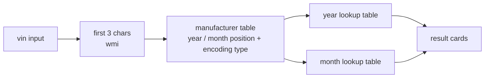

<div align="center">

# vin-decoder

**a client-side vin decoder for indian vehicles.**
17 manufacturers, zero runtime dependencies, zero api calls. paste a vin, get the maker, year and month of manufacture.

[](https://vin.kjhq.dev)

[](https://developer.mozilla.org/docs/Web/HTML)
[](https://developer.mozilla.org/docs/Web/CSS)
[](https://developer.mozilla.org/docs/Web/JavaScript)
[](https://workers.cloudflare.com/)

</div>

---

## features

- **instant decoding** in the browser, nothing is sent anywhere
- **17 manufacturers** commonly sold in india
- **manufacturer, year and month** from the vin's own encoding rules
- handles **6 year encodings** and **5 month encodings** used by different makers
- clear warnings for unknown manufacturer codes or makers that don't encode a year / month
- tiny static site: one html page, one script, one stylesheet

---

## supported manufacturers

| | | | |
|---|---|---|---|
| tata motors | mahindra | maruti suzuki | hyundai |
| toyota | honda | ford | chevrolet |
| mitsubishi | nissan | renault | kia |
| volkswagen | skoda | fiat | jeep |
| mg | | | |

---

## how it works



1. enter a vin (e.g. `MAT629103K1H01674`)
2. the first 3 characters (the world manufacturer identifier, wmi) select the manufacturer
3. each manufacturer entry says where the year and month codes sit in the vin and which encoding they use
4. the codes are looked up in the matching year / month tables and shown in a card layout

examples of the encodings it handles:

| encoding | mapping | used by |
|---|---|---|
| year type 1 | letter `A`-`Y` → 2010-2030 | tata, honda, mahindra, hyundai, nissan, mg, etc. |
| year type 4 | 2 digits → 2010-2030 | volkswagen, toyota |
| year type 5 | `5`-`9`, `A`-`Y` → 2005-2030 | maruti suzuki |
| month type 1 | letter → jan-dec | tata |
| month type 2 | `A`-`M` → jan-dec | honda, hyundai, mahindra, kia, etc. |
| month type 5 | `1`-`9`, `A`-`C` → jan-dec | nissan, renault |

---

## tech stack

- pure vanilla html / css / js, no framework, no build step
- all decoding happens client-side; the lookup tables live in `public/script.js`
- served as static assets from **cloudflare workers**, with a small worker that sets cache headers (7 days for js / css / images, 5 minutes for html)
- `wrangler` is the only (dev) dependency

---

## getting started

```bash
git clone https://github.com/kjhq/vin-decoder.git
cd vin-decoder
npm install
npm run preview   # wrangler dev, or just open public/index.html
```

### deploy

```bash
npm run deploy    # wrangler deploy
```

the worker name, asset directory and custom domain are set in `wrangler.jsonc`. there are no environment variables.

---

## project structure

```
vin-decoder/
├── public/
│   ├── index.html        # the decoder page
│   ├── script.js         # manufacturer + year / month lookup tables, decoding
│   ├── style.css
│   └── disclaimer.html   # legal disclaimer
├── workers/
│   └── asset-cache.js    # serves assets, sets cache-control
├── wrangler.jsonc
├── package.json
└── TODO
```

---

## known limitations

- no support for older maruti suzuki (pre-2010 encoding)
- volkswagen and skoda share `MEX` after 2021, so those vins are ambiguous
- fiat and jeep share the `MCA` code; the table currently resolves it to jeep
- ford month encoding is not implemented yet
- decodes manufacturer, year and month only, not plant or serial number

issues and prs welcome.

---

## disclaimer

results are best-effort and for information only. see the [legal disclaimer](public/disclaimer.html).

---

<div align="center">

built by [kjhq](https://kjhq.dev) · [@kjhqdev](https://x.com/kjhqdev)

</div>
